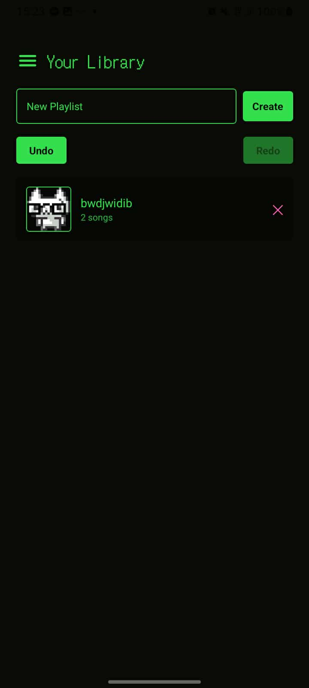
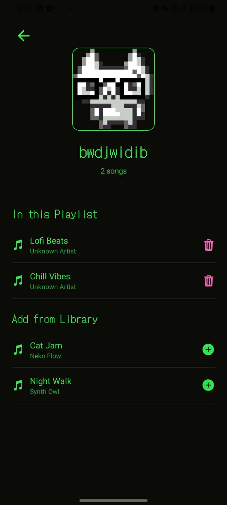
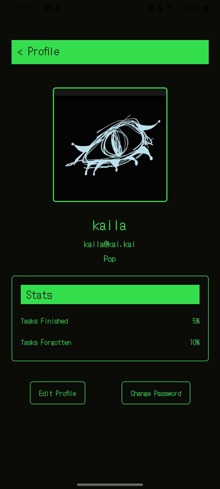
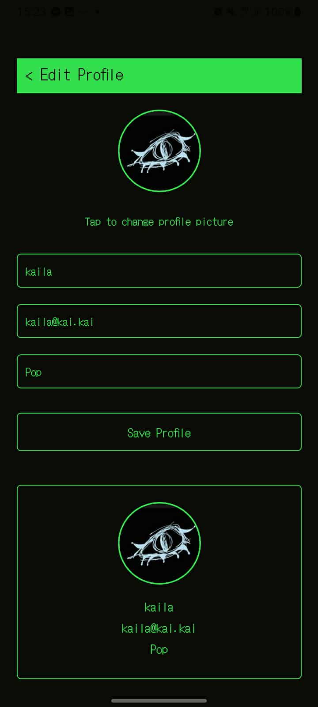
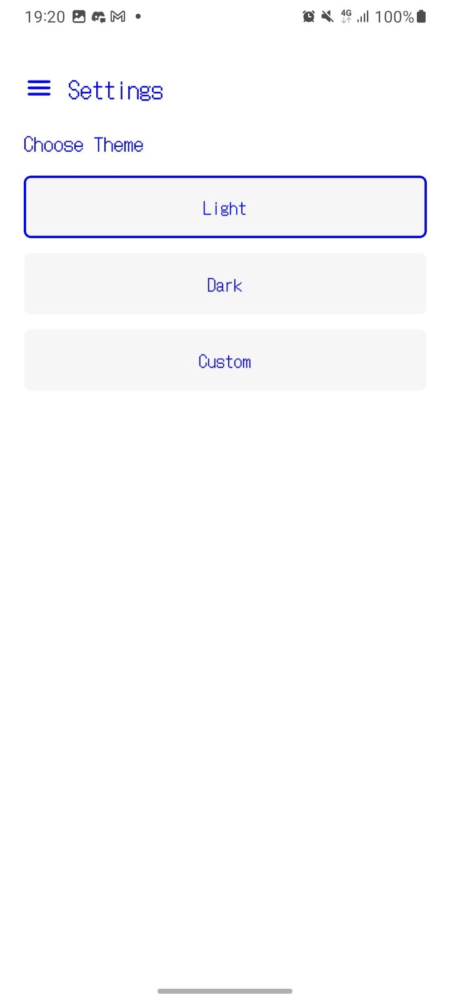
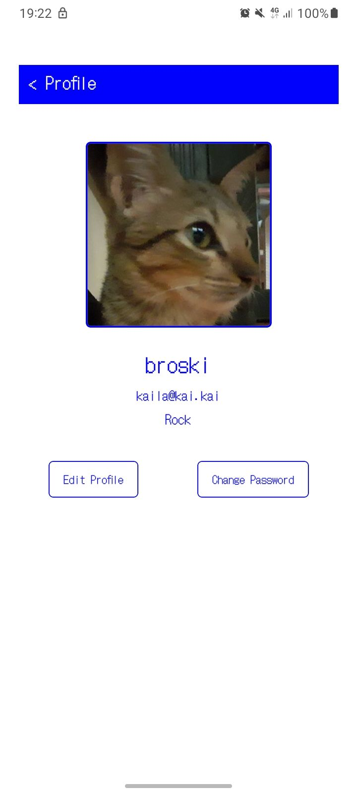
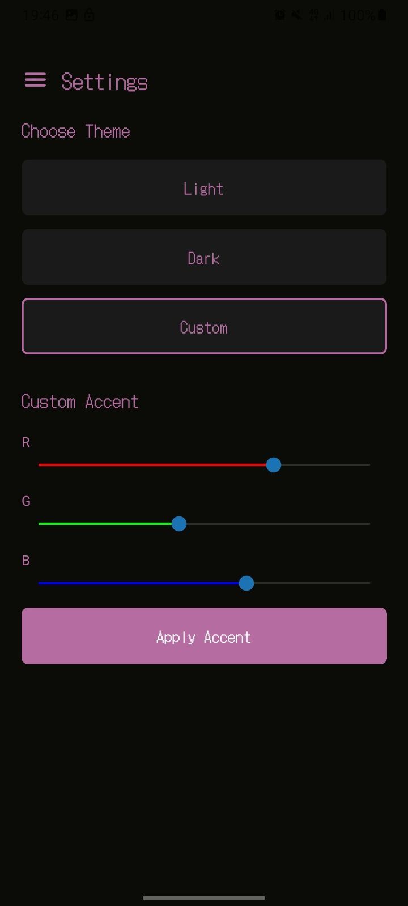

# Advance Mobile Development - IT5103N

## Week 2 [September 5]
#### Assignment:
* Design a login page to be spotify-like
* Implement a drawer navigator

#### Documentation:
  Basically, what we did this week is implement a "spotify-like" login page. But me being me, I wanted to make it match the vibes that the app originally had but in the end I changed up the entire thing to match the black and green vibes of the login page (very brat-summer, except it's not summer and it's a project that my grade is based on...)
  

    
    
    
    
  

#### Reflection:
  The struggle that I faced when doing this task was,,, if I remember correctly... trying to get started. But you know, when I got the "momentum" it was just a "breeze".

## Week 3 [September 12]
#### Assignment:
* Implement Gestures
* Add custom Transitions
* Implement Navigation Persistence

#### Documentation:
  A gesture is when you swipe right/left on you mobile phone and it:
    1. refreshes the page (though, that is when you swipe up not left and right). 
    2. goes back to the previous page.
  Then a transistion effect is just for aesthetics... honestly speaking. Presistence behavior is the important thing for this assignment/task though, it is basically making sure that when you accidentally press the home button, when you open the app back up, you will be "redirected" to the last page that you visited before you accidentally hit the home button.

#### Reflection:
  Man, honestly... My brain was too pre-occupied with a major exam approaching and all other subjects trying to make my life too overwhelming to the point where I mentally clocked out... Anyway, the struggle when doing this task was my attention span and interest being at the all time low. All jokes aside, the challenging part was implementing the navigation drawer and customizing it (see: aesthetics), I reached out to the docs, chatgpt, the docs again just to make that navigation drawer match the rest of the app.

## Week 4 [September 25]
#### Assignment:
* Build a Playlist Interface
* Add Animations
* Implement Undo/Redo
* Add State Persistence

#### Documentation:
  No documentation,,, because i'm not yet done...

  

#### Reflection:
  I should've done this after my exam... #regrettingLifeDecisions #mababangScoreAtMababangResistensya #gotTooBusyCoping

## Actual Week 4 [September 30]
#### Assignment 1:
* Build a Playlist Interface
  * Add Animations
  * Implement Undo/Redo
  * Add State Persistence

#### Assignment 2:
* Spotify Profile Creation Form
  * Build Profile Form with Enhanced Validation
  * Add Animations
  * Implement Form Caching
  * Build Dynamic Profile Preview

#### Assignment 1 Documentation:
Here is the playlist... Makes me want to end it all ngl bro. I have nothing to say, but yk it made me realized that I don't like doing things when its not the vibes im going for. 

  
  

#### Assignment 2 Documentation:
NGL.... I have nothing in my brain rn, will update when I can.

  
  

#### Overall Reflection for Week 4:
I have no one to blame but me (and my phone deciding that it wont connect to the wifi, but overall the blame goes on me for not searching alternative ways to access my project). Being self-reliant is better than being reliant on AI... FREE ME FROM THE SHACKLES OF MY OWN INCOMPETENCE AND STUPIDITYYY !!KSFHAKJSHDFKJ (someone said im not stupid, but they never correct the incompetent part... so there is that #freeMeFromMyOwnIncompetence)

## Week 5
#### Activity 1 - Unfinished

#### Documentation:
##### Light Mode:

  
  

##### Custom Dark Mode (Accent color only):

  
  

